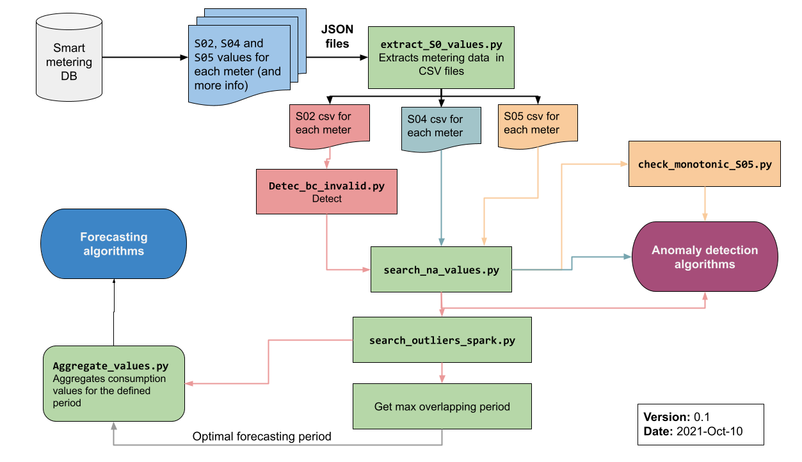

# smart_meter_data_analysis
This repository contains all the code developed to analyze smart meter data with HTM and LSTM algorithms.

## 1. Data pre-processing
These scripts are used to parse the data coming from the smart meters into CSV files so that we can process them easier.
The data comes is received using PRIME protocols and it includes hourly and daily reports. These data meter files include the data
in JSON format (include JSON schema).

The sections below describe the different steps followed to pre-proces the data before applying the forecasting algorithms.

The diagram below [access the original diagram here](https://docs.google.com/drawings/d/1ok1GTcwCHfuA2TeDtyF2UXJ5MVRrDaL4ktEAegRyHDM/edit?usp=sharing) depicts the global data processing from the raw JSON data to the data ready to be used as input for the forecasting and anomaly detection algorithms.




### 1.1 Extraction of S02, S04 and S05 values
The original raw files included the S02 (hourly values), S04 (daily values) and S05 (monthly values) record for each meter. In order to use those values in the forecasting algorithms we need to separate the records in different files (one for each type of record).
The input variables of the script [extract_S0_values.py](extract_S0_values.py) used to separate the values are as follows:
- the folder where the original files are located.
- the folder where the processed files will be stored. There will be three files per meter with this name pattern: 'meter_data_<meter ID>' 

### 1.2 Optimal forecasting range discovery
In order to achieve have a wider sample of meters, we tried to find the longest period of time including as many meter samples as possible. In other words, as not all the meters include the very same time range. In order to try to detect yearly patterns we needed to find a range longer than 1-year. Ideally the time range should be longer than 2-years so that the algorithm can take advantage of what it learnt from the previous year. However, we may have different range of days for each meter, so in order to do aggregated estimations we should consider the period for which we have the maximum number of samples. In order to find the optimal time range an algorithm was developed. It tries to find the time range where we have more meter providing data simultaneously. 

The algorithm is implemented and explained in details in [Max_overlapping_timeseries.ipynb]([Max_overlapping_timeseries.ipynb](https://colab.research.google.com/drive/1NN57jbL9MrJkqNKgDjVBfLm9RMyWNHvy?usp=sharing)). This scrip can be used for any set of data series where it is needed to find the maximum number of overlapping series. 

##### Input 

CSV file with the fields as follows:

|  `Start date` | `Timeseries ID` | `Duration of timeseries in days` = `End date` - `Start date` |

For example:

```
#Start date, meter ID, Duration in days
2019-06-02T09:37:00.000Z, vgbiwenoi2323, 367
2019-06-05T09:37:00.000Z, dscafweee3498, 450
2019-06-06T09:37:00.000Z, cncinnenr7325, 348
2019-06-09T09:37:00.000Z, onjdqweni8623, 317
2019-06-10T09:37:00.000Z, eiwhdoqwu3764, 347
2019-06-11T09:37:00.000Z, lidscbnqo1387, 227
2019-06-13T09:37:00.000Z, vgbiweeef2424, 367
2019-06-13T09:37:00.000Z, ebnqiunin1298, 387
2019-06-18T09:37:00.000Z, ommfiunun3546, 357
2019-06-21T09:37:00.000Z, tyrfeunht6543, 398
```

##### Output
It generates a display output as follows so that the researcher can decide what is the optimal time period:

```
Period of 435 days: 15656 meters starting at 2019-11-28 01:00:00
Period of 440 days: 15655 meters starting at 2019-11-28 01:00:00
Period of 445 days: 15655 meters starting at 2019-11-28 01:00:00
Period of 450 days: 15654 meters starting at 2019-11-28 01:00:00
Period of 455 days: 15653 meters starting at 2019-11-24 23:00:00
Period of 460 days: 15653 meters starting at 2019-11-28 01:00:00
Period of 465 days: 15653 meters starting at 2019-11-28 01:00:00
Period of 470 days: 15652 meters starting at 2019-11-24 23:00:00
```

Modifying the Jupiter file it is also possible to get a list with the meters to be used for the analysis. 

### 1.3 Data validation scripts
#### 1.3.1 Detect N/A values in the CSV files
The script [search_na_values.py](search_na_values.py) searchs for N/A values in the different S0X csv files and generates an output file.
##### Input 
Folder with S02, S04 and S05 files.
##### Output
(*na_values.txt*) with the rows with N/A values.
#### 1.3.2 Detect S05 values are monotonic
S05 show the total active power consumption registered by the meter. Since these meters are for consumers we should not have any negative increment in these values. The script  [check_monotonic_s05.py](check_monotonic_s05.py) analyzes the S05 files from all the meters and generates an output file including all the timestamps of negative increments along with the meter ID.

##### Input 
Folder with S05 files.
##### Output
(*non_monotonic_values.txt*) with the meters which show non-monotonic S05 values.

#### 1.3.3 Detect invalid data
The PRIME protocol requires the addition of a field BC in S0X fields. This is the result of a binary comprobation of the results. If the value is higher than x80 (128 in decimal) the result must be considered as no valid. The script [detect_bc_invalid.py](detect_bc_invalid.py) generates an output file which includes all the invalid records along wit the meter ID.
##### Input 
Folder with S02 files.
##### Output
(*called invalid_data.csv*) including all the invalid records along wit the meter ID.

### 1.4 Outlier detection
In order to evaluate and avoid the effect of outlier values in the prediction there were used mechanisms to detect outliers values. We created two versions of the outlier detection scripts: one just using Python libraries and another using the pyspark Python library to take advantage of *Spark* in order to improve the performance of the outlier detection. The name of the Spark version of the script is [search_outliers_spark.py](search_outliers_spark.py).

The scripts remove the values which are above 4 times the standard deviation. This threshold can be easily changed in the script. 
#### Input
A CSV file with the ID of the meters with valid data for a given period. In the repository, we hardcoded a CSV file with the IDs of complete data for the year 2020.

#### Output
NUmber of outliers for S02 files and CSV file with the number of outliers per meter.


### 1.5 Data aggregation
It aggregates S02 and S05 CSV files from 10% to 100% in 10% steps, and, therefore, generating 10 files. It needs a CSV file with the data from all the meters which have data for all 2020 (see get_overlapping_dates_meters.py).
It is used to check how impacts the level of aggregation in the accuracy of ML forecasting algorithms.

#### Input 
CSV file with the data from all the meters which have data for a given period of time (see get_overlapping_dates_meters.py).
Optionally, a CSV file with the detected outliers can be used, so the outliers will be removed from the aggregations.

#### Output
Set of 10 files with aggregated values for both S02 and S05.

## ARIMA analysis

TO BE COMPLETED

## LSTM analysis

TO BE COMPLETED
